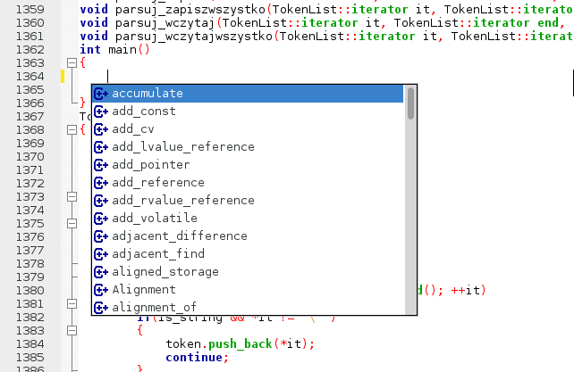
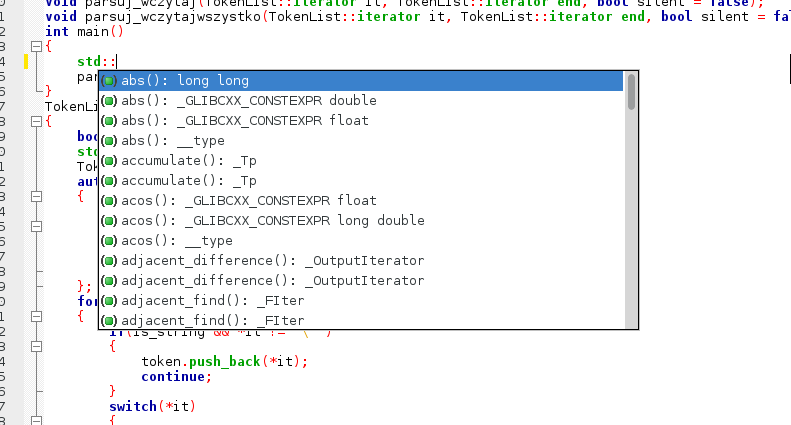
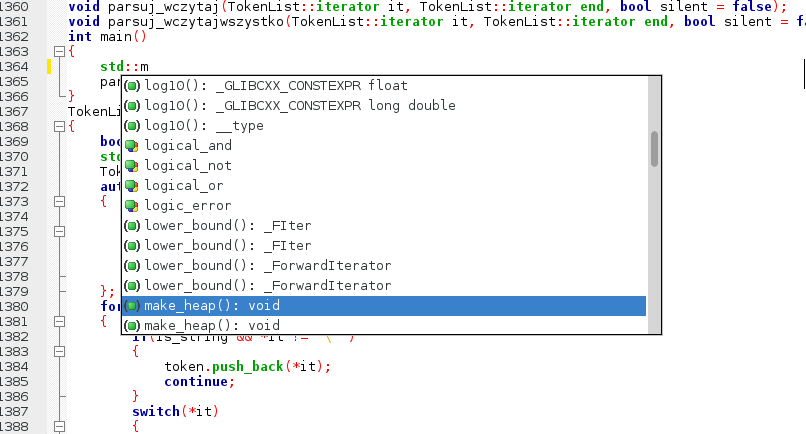
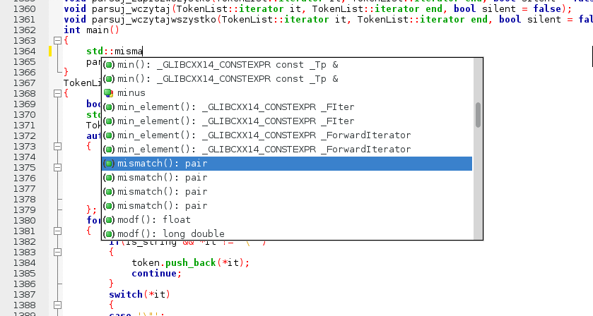
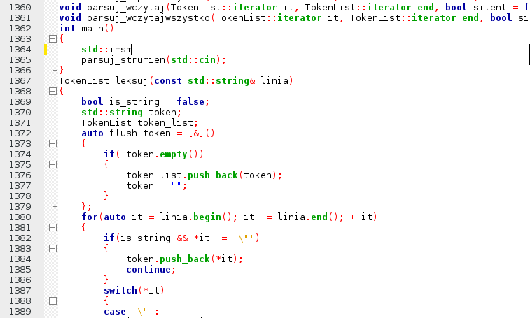

Autocompletion in `main()`
--------------------------

IDE opened the file correctly, and parsed it without error.

Opening up autocompletion with `Ctrl+Space` triggers the following pop-up dialog:

Many names are listed, but there's no visible distinction which names are types, functions or variables.

Only after typing `::` Code::Blocks does more intelligent suggestions.

Relevant functions are suggested, but no info about arguments until the function is selected with `Tab`.

Code::Blocks doesn't do fuzz-matching.