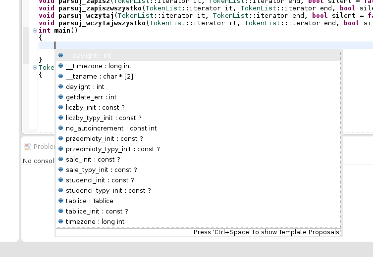
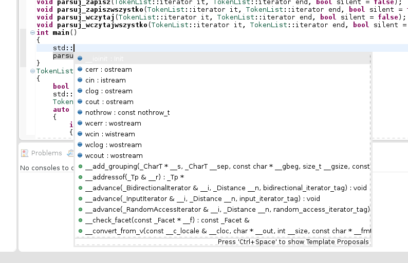
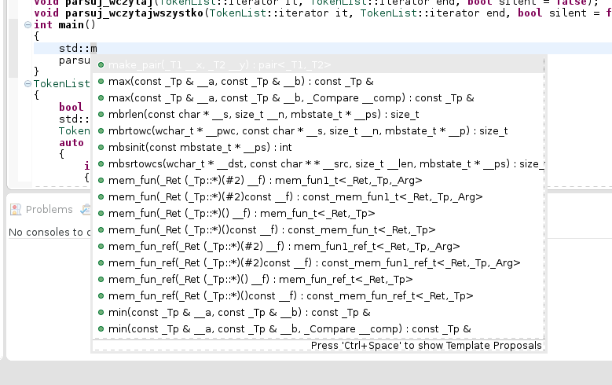
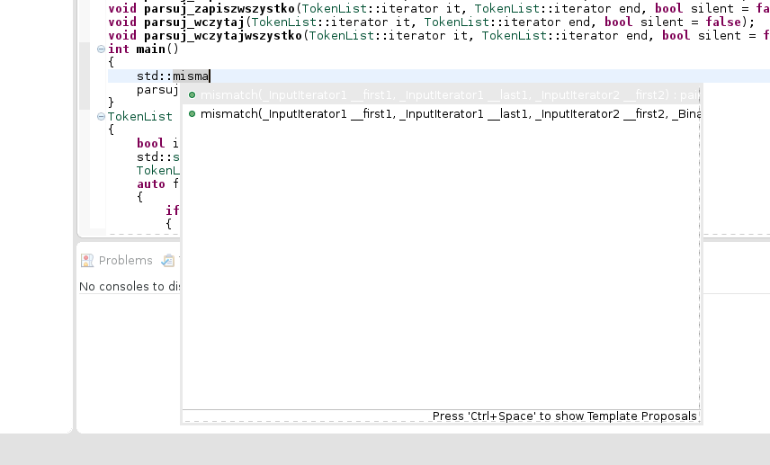
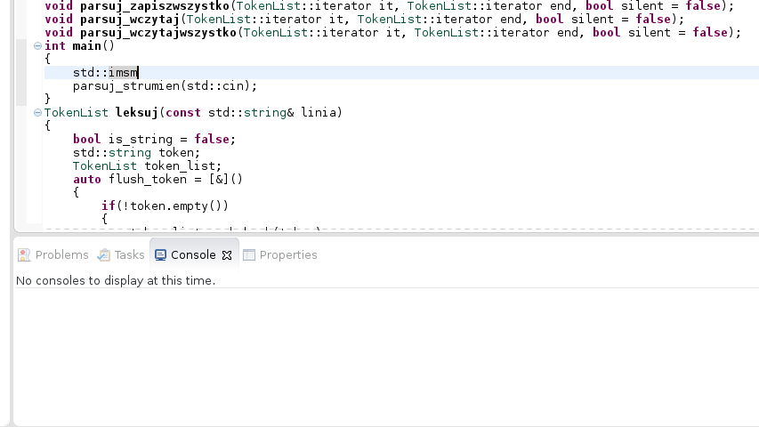

Autocompletion in `main()`
--------------------------

IDE opened the file correctly, and parsed it without error.

Opening up autocompletion with `Ctrl+Space` triggers the following pop-up dialog:

Listed are names from standard library, and from current file. Note that IDE gave up on constants with more complicated types: `przedmioty_init` with type `const std::array<std::string, 3>` is listed as `const ?`.

Listed are some global variables, and some irrelevant functions that are implementation details.

Thankfully it gets slightly more helpful after the first letter.

Relevant functions are suggested with full argument types and names. 

Eclipse CDT doesn't do fuzz-matching.