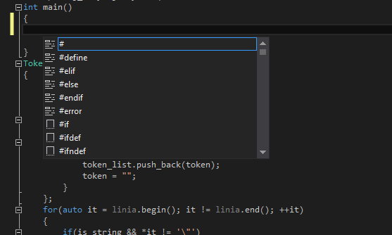
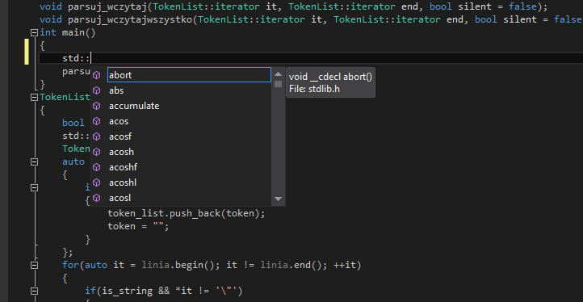
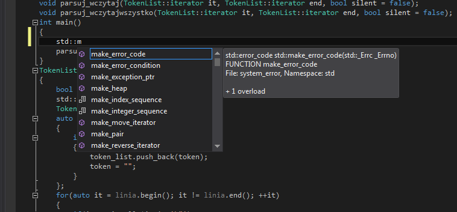
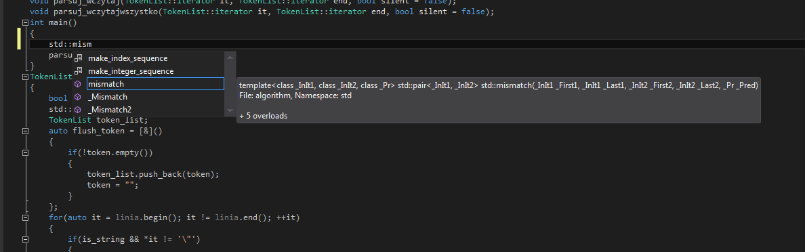
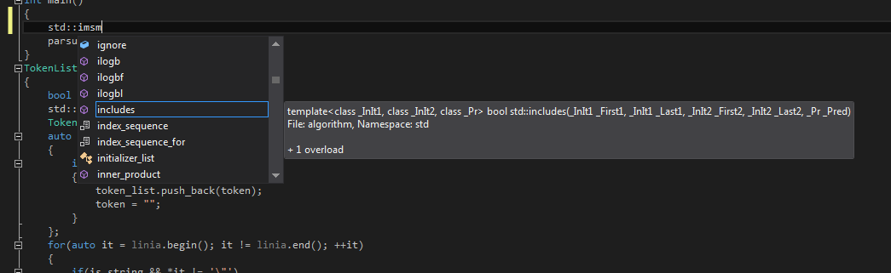
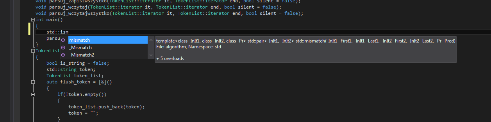

Autocompletion in `main()`
--------------------------

IDE opened the file correctly, and parsed it without error.

Opening up autocompletion with `Ctrl+Space` triggers the following pop-up dialog:

Listed are names from current file, and included in the headers. Also "quick snippets" and preprocessor directives.

Only function names are displayed in the listbox. Multiple overloads are congregated into one selection. 

Visual Studio trying to do fuzz-matching.  

`std::mismatch` is matched even when the first letter is missing.